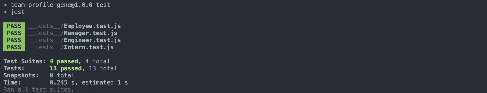
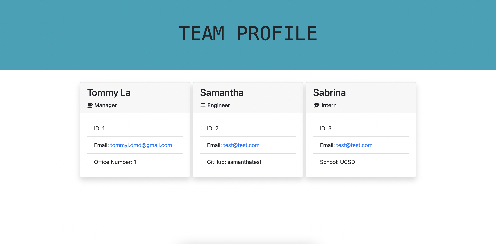

# Team Profile Gene

This project was for my UCSD Coding Bootcamp, creating a Team Profile Generator.

## Demo Video & Repository

* [GitHub Repo](https://github.com/latommyla/Team-Profile-Gene)

https://user-images.githubusercontent.com/85325106/142718309-e28aa00e-17ad-400b-a419-aef35ded9d08.mp4

## Description 

To build a Node.js command-line application that takes in information about employees on a software engineering team, then generates an HTML webpage that displays summaries for each person. 

## What was used in the project? 

- JS
- Node.js

## Feature

- Six JS Pages - index.js, generateHTML.js, Employee.js, Engineer.js, Intern.js, & Manager.js
- 4 Test JS Pages - Employee.test.js, Engineer.test.js, Intern.test.js, & Manager.test.js
- Two JSON Pages - package-lock.json & package.json

## Installation

To install this project, simply download the zip file or clone the SSH key to your terminal. GitHub has instructions on how to do this. Also will need to install NODE.js in order to run build fucntions within your terminal.

- Also will need to install inquirer.js package & jest

## Test

## Preview 

Final output of the generated HTML file.

## Contact 

- [Portfolio](https://latommyla.github.io/TL-Portfolio/)
- [LinkedIn](https://www.linkedin.com/in/tommymla/)
- [My Gmail](mailto:tommyl.dmd@gmail.com)
- [GitHub](https://github.com/latommyla)
- [Instagram](https://instagram.com/latommyla)
